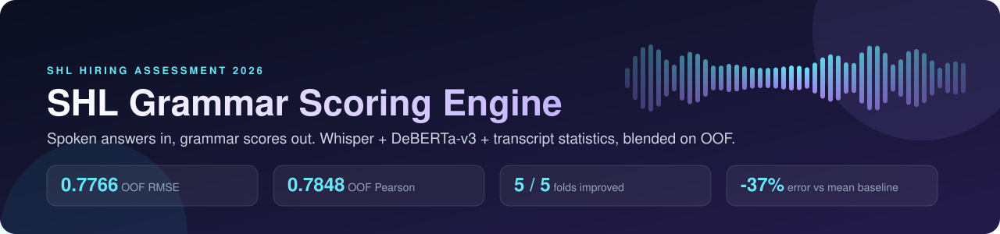
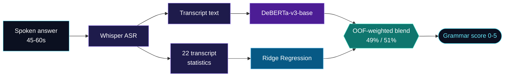
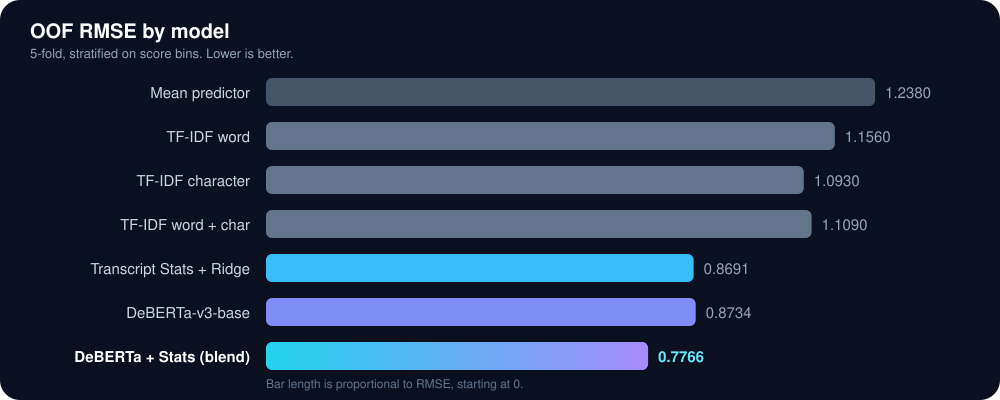

 

**769 labeled clips &nbsp;|&nbsp; 216 test clips &nbsp;|&nbsp; 0 to 5 grammar score &nbsp;|&nbsp; metrics: RMSE + Pearson**

---

## The idea

A 45 to 60 second spoken answer carries more signal than its words alone. I tested that by pulling out **what was said** (transformer view of the transcript) and **how it was structured** (22 hand-built statistics), then blending the two on out-of-fold predictions.

---

## Results

<table>
<tr>
<td width="50%" valign="top">

### How the score improved

| Step | What changed | RMSE |
|:---|:---|---:|
| 1 | Mean predictor baseline | 1.238 |
| 2 | TF-IDF (best: character n-grams) | 1.093 |
| 3 | 22 transcript statistics + Ridge | **0.869** |
| 4 | DeBERTa-v3-base on full transcript | 0.873 |
| 5 | **Blend of 3 and 4** | **0.7766** |

Pearson went from 0.712 (stats) and 0.718 (DeBERTa) to **0.785** for the blend. Total RMSE drop vs the mean baseline: **37%**.

</td>
<td width="50%" valign="top">

### What the experiments showed

- **Surface n-grams plateau fast.** Adding word n-grams on top of character n-grams made it worse (1.109 vs 1.093).
- **Structure beats vocabulary.** Fluency, sentence shape, repetition, lexical diversity, speech rate, pauses and ASR confidence in just 22 features matched a transformer.
- **Equal scores, different mistakes.** The two models scored almost the same alone, but their residual correlation was only **0.592**.
- **That gap is the win.** Blending cut RMSE by **0.0968** over the best single model.

</td>
</tr>
</table>

### The blend improved every single fold

| Fold | DeBERTa alone | Blend | Gain |
|:---:|:---:|:---:|:---:|
| 0 | 0.7550 | **0.6382** | +0.1167 |
| 1 | 0.9958 | **0.8922** | +0.1037 |
| 2 | 0.8541 | **0.7639** | +0.0903 |
| 3 | 0.9342 | **0.8460** | +0.0883 |
| 4 | 0.8057 | **0.7158** | +0.0898 |

> **5 out of 5 folds improved.** The 49/51 weight was picked from training OOF predictions, never by probing the public leaderboard.

---

## Engineering choices

<table>
<tr>
<td width="25%" valign="top">

**Leakage-safe validation**

Fixed 5-fold split, stratified on score bins. Every candidate model produces OOF predictions on the exact same folds, so comparisons are fair.

</td>
<td width="25%" valign="top">

**Cached ASR**

Whisper transcripts and derived features are cached, so the expensive audio step runs once and every later experiment is fast.

</td>
<td width="25%" valign="top">

**Complementary models**

A compact, interpretable statistical model paired with a contextual transformer, instead of betting on one big model.

</td>
<td width="25%" valign="top">

**Reproducible artifacts**

OOF predictions, test predictions and intermediate results are saved under `/kaggle/working/shl/`.

</td>
</tr>
</table>

---

## Final submission

**49% DeBERTa-v3-base + 51% Transcript Statistics Ridge**

`216 / 216` test predictions &nbsp;|&nbsp; `0 NaN` &nbsp;|&nbsp; `0 Inf` &nbsp;|&nbsp; clipped to the valid `0-5` range &nbsp;|&nbsp; output: `submission.csv`

### Takeaway

**Grammar scoring did not need a bigger model. It needed a second, different view of the same speech.**

 

**Vansh** &nbsp;|&nbsp; [Portfolio](https://vanshbhutani.me) &nbsp;|&nbsp; [GitHub](https://github.com/vanshbhutani1405) &nbsp;|&nbsp; [LinkedIn](https://linkedin.com/in/vansh-62b84a184) &nbsp;|&nbsp; [Kaggle](https://kaggle.com/vanshbhutani)

